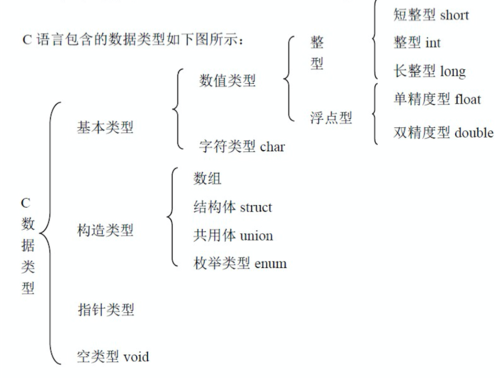
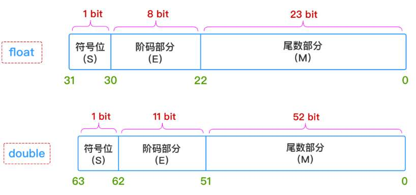
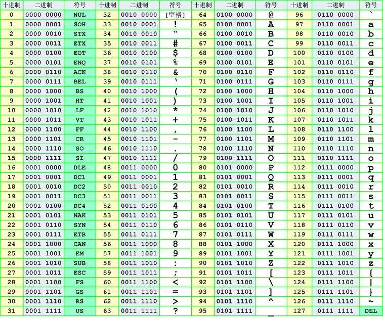
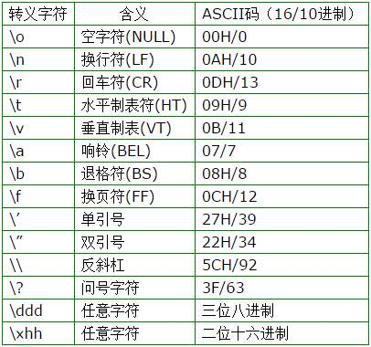
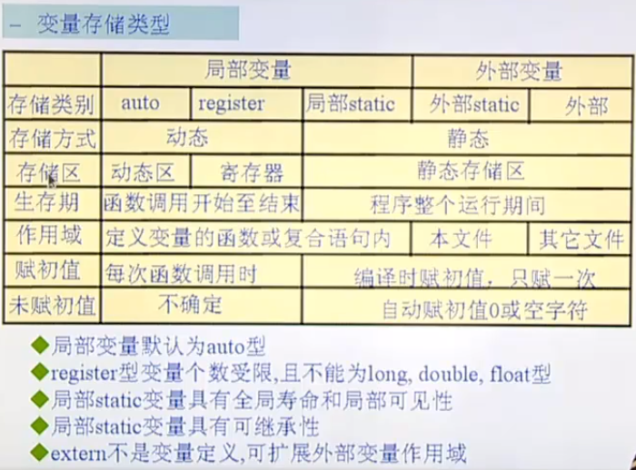

<b>大纲</b>

   * [1.数据类型分类](#1数据类型分类)
   * [2.二进制及数值类型的存储](#2二进制及数值类型的存储)
      * [进制转换](#进制转换)
      * [各进制表示](#各进制表示)
      * [补码](#补码)
      * [浮点数的存储形式](#浮点数的存储形式)
      * [ASCA码对照表](#asca码对照表)
   * [3.常量与变量](#3常量与变量)
      * [常量](#常量)
         * [define](#define)
         * [一个例子](#一个例子)
      * [变量](#变量)
         * [定义](#定义)
         * [static的特点和作用](#static的特点和作用)
         * [变量的生命周期和作用范围](#变量的生命周期和作用范围)


<b>学习重点</b>

> 1. 不同类型数据所占字节数
>2. 存储区别
> 3. 数据类型间的转换
> 4. 特殊性
>    1. 布尔类型
>    2. float的精度问题
>    3. char的符号
>    4. 不同形式的0值：0,'0',"0",'\0'
>    5. 数据类型与后续代码中所使用的输出要相符


# 1.数据类型分类



# 2.二进制及数值类型的存储

## 进制转换

十进制转二进制：除二倒序取余

如 (254)<sub>10</sub> = (11111110)<sub>2</sub> = (376)<sub>8</sub> = (FE)<sub>16</sub>

- 二进制转换为八进制三个一组

- 二进制转换为十六进制四个一组

## 各进制表示

十进制：254

- 二进制：B11111110
- 八进制：0376
- 十六进制：0xFE

## 补码

计算机中数值以二进制的补码形式来存储。

- 正数的补码是其本身
- 负数的补码是将其绝对值的补码取反，再加1

## 浮点数的存储形式




## ASCA码对照表



详见：[ASCII对照表](https://tool.oschina.net/commons?type=4)

# 3.常量与变量

常量：值不可改变，赋值操作会报错。

变量：程序运行过程中值可以发生改变。

## 常量

- 整型常量：1，306
- 实型常量：1.9，0.444
- 字符型常量：有单引号括起来的单个字符或转义字符，如'a','\015','\x7f','\018'



- 字符串常量：由双引号括起来的一个或多个字符组成的序列，如"helloworld"。
- 标识常量：#define，在程序的预处理阶段，占用编译时间而非运行时间，一改全改，缺点是不会检查语法，只是单纯的宏体与宏名之间的替换。

### define

定义宏的格式为：`#define 宏名 宏体`，如：

```c
#define PI 3.14abc
```

在程序进行与编译的过程中，所有的PI都会被替换成宏体，但是不会进行类型检查，举例如下：

```c
#include <stdio.h>
# define ADD 2+3

int main(){
	printf("%d\n", ADD * ADD);
	exit(0);
}
```

`gcc -E test.c`查看预处理后的文件为：

```c
int main(){
 printf("%d\n", 2+3 * 2+3);
 exit(0);
}
```

预想的结果是25，实际结果是11，如果希望正常显示则需要定义为`#define ADD (2+3)`。

### 一个例子

```c
 #include <stdio.h>
 #include <stdlib.h>

#define ADD 2+3
#define MAX(a,b) (a > b ? a : b)

int main(){
    int i = 5, j = 3;
    printf("i = %d\tj = %d\n", i, j);
    printf("%d\n", MAX(i++, j++));
    printf("i = %d\tj = %d\n", i, j);
    exit(0);
}
```

预想结果是输出后的`i = 6`, `j = 4`，执行结果却是：

```c
i = 5   j = 3
6
i = 7   j = 4
```

查看原因实际上预处理过的主程序变成：

```c
int main(){
    int i = 5, j = 3;
    printf("i = %d\tj = %d\n", i, j);
    printf("%d\n", (i++ > j++ ? i++ : j++));
    printf("i = %d\tj = %d\n", i, j);
    exit(0);
}
```

可见在判断的时候自增了一次，选择条件的时候`i`又自增了一次，而`j`因条件不满足没有变化。

<b>解决方法一</b>

```c
int max(int a, int b){
  return a > b ? a : b;
}
```

可以通过将宏定义替换成相同功能的函数来解决。那如何决定何时来使用宏还是定义函数呢？

- `#define` 占用的是编译时间，相比函数要危险，但是可以节省运行时间。适用于内核底层的开发，追求效率。
- 函数：占用运行时间，有入栈-执行-出栈的过程。适用于应用层的稳定开发。

<b>解决方法二</b>

```c
#define MAX(a,b) \
				({int A = a, B = b; ((A) > (B) ? (A) : (B));})
```

修改宏定义的参数类型，编译后的程序为：

```c
int main(){
    int i = 5, j = 3;
    printf("i = %d\tj = %d\n", i, j);
    printf("%d\n", ({int A = i++, B =j++; ((A) > (B) ? (A) : (B));}));
    printf("i = %d\tj = %d\n", i, j);
    exit(0);
}
```

执行结果为：

```c
i = 5   j = 3
5
i = 6   j = 4
```

同理也可以使用`typeof()`函数来判断输入参数的类型并重新定义：

```c
#define MAX(a,b) \
				({typeof(a) A = a, B = b; ((A) > (B) ? (A) : (B));})
```

## 变量

### 定义

```c
[存储类型] TYPE NAME = VALUE;
```

变量由`[存储类型]  数据类型  标识符 = 值`几个部分组成。

- 标识符：由字母，数字，下划线组成且不能以数字开头的一个标识序列。（匹配一块地址空间）写标识符要语义化。
- 数据类型：基本数据类型/构造类型
- 存储类型：auto | static | register | extern(说明型)，存储类定义 C 程序中变量/函数的范围（可见性）和生命周期。
  - auto：默认存储类型，自动分配空间，自动回收空间。
  - static：静态型，自动初始化为0值或空值。变量的值有继承性。
  - register：寄存器类型（建议型）。只能定义局部变量；大小有限制，只能定义32位大小的数据类型；没有地址，无法打印出地址查看或使用。（需要大量使用，建议将存储空间放到寄存器，GCC起决定作用，一般情况下是不会）
  - extern：说明型，意味着不能改变说明的变量的值和类型。但可以扩展变量的值，使其能从其他文件引用被修饰的变量。详见[C/C++中extern关键字详解](https://www.cnblogs.com/yc_sunniwell/archive/2010/07/14/1777431.html)和[extern 与头文件(*.h)的区别和联系](https://www.runoob.com/w3cnote/extern-head-h-different.html)

### static的特点和作用

- static修饰的值具有继承性。

  举例：有如下程序，调用三次`func()`：

  ```c
  #include <stdio.h>
  #include <stdlib.h>
   
  void func(void){
    int x = 0;
    x = x + 1;
    printf("%p->%d\n", &x, x);
  }
  
  int main(){
  	func();
  	func();
    func();
    exit(0);
   }
  
  ```

  查看结果为：

  ```c
  0x7ffd51dbb4ac->1
  0x7ffd51dbb4ac->1
  0x7ffd51dbb4ac->1
  ```

  可见默认为`auto`类型的值，每次在函数调用时都会被清空，也就是在函数结束后会被回收。

  现在将默认为`auto`类型改为`static`类型，运行结果为：

  ```c
  0x601040->1
  0x601040->2
  0x601040->3
  ```

-  static修饰变量或函数。

有如下三个程序文件：

```c
//main.c
#include <stdio.h>
#include <stdlib.h>

#include "proj.h"

int i = 10;
int main(){
	printf("[%s]:i = %d\n", __FUNCTION__, i);
	func();

	exit(0);
}
```

```c
//proj.c
#include <stdio.h>
#include <stdlib.h>

#include "proj.h"

int i = 100;

void func(void){
    printf("[%s]:i = %d\n");
    exit(0);
}
```

```c
//proj.h
#ifndef PROJ_H__
#define PROJ_H__

void func(void);

#endif
```

编译的时候出现错误：`multiple definition of i ` ，这是因为在`main.c`和`proj.c`中定义的变量都为全局变量。

在文件`proj.c`中变量定义前加上`static`关键字，即可限制其的作用域在当前文件中。

同理若用`static`修饰`proj.c`中的函数`func`，即限制当前函数往外扩散，无法被其他函数调用。解决方法可以通过间接调用。

```c
/********main.c*******/
int main(){
	printf("[%s]:i = %d\n", __FUNCTION__, i);
	call_func();
	exit(0);
}

/********proj.c*******/
static int i = 100;

static void func(void){
    printf("[%s]:i = %d\n",__FUNCTION__,i);
    exit(0);
}

void call_func(){
    func();
}

/********proj.h*******/
#ifndef PROJ_H__
#define PROJ_H__

static void func(void);

#endif
```

全局变量习惯性用static修饰，目的是为了防止与其他同名变量冲突。用static修饰函数是强调当前函数不可外部扩展，而是隐藏起来通过变相提供的接口来访问。

参考：

- [static作用（修饰函数、局部变量、全局变量）](https://www.cnblogs.com/stoneJin/archive/2011/09/21/2183313.html)

- [C/C++ 中 static 的用法全局变量与局部变量](https://www.runoob.com/w3cnote/cpp-static-usage.html)


### 变量的生命周期和作用范围

1）全局变量和局部变量

全部变量的缺陷：一个模块对全局变量的改变可能会影响其他模块的使用。

```c
#include <stdio.h>
#include <stdlib.h>

int i = 0;

void print_star(void){
  for(i = 0; i < 5; i++)
    printf("*");
  
  printf("\n");
  printf("[%s]i = %d\n", __FUNCTION__, i);
}

int main(){
  for(i = 0; i < 5; i++)
    print_star();
  
  printf("[%s]i = %d\n", __FUNCTION__, i);
  
  exit(0);
}
```

如上程序预想输出无行星号，结果为：

```c
*****
[print_star]i = 5
[main]i = 6
```

原因是在第一次调用`print_star()`函数的过程中已经修改全局变量`i`的值为5了，主函数中条件不满足退出循环。

2）局部变量间的关系

3）变量存储类型

