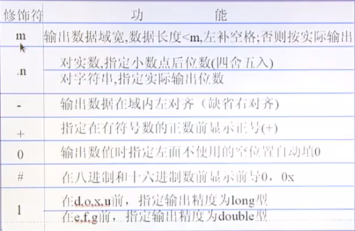
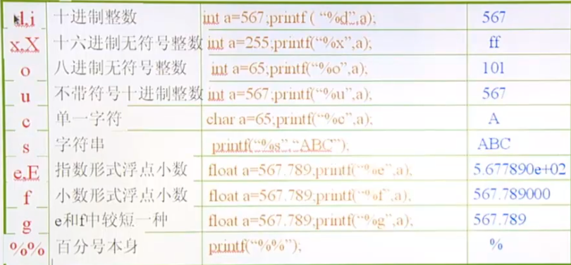

<b>大纲</b>

   * [格式化输入输出函数](#格式化输入输出函数)
      * [printf](#printf)
         * [变参](#变参)
         * [缓存区刷新](#缓存区刷新)
      * [scanf](#scanf)
   * [字符输入输出函数](#字符输入输出函数)
      * [getchar](#getchar)
      * [putchar](#putchar)
   * [字符串输入输出函数](#字符串输入输出函数)
      * [gets(!)](#gets)
      * [puts](#puts)
   * [测试练习](#测试练习)

I/O（标准IO，文件IO）

# 格式化输入输出函数

## printf

格式：`printf("%[修饰符] char *format") `

常用修饰符表：



标准输出格式字符如下：



### 变参

接受的参数个数不固定。如

```c
printf("%d %s\n", i);
```

有两个格式化输出，但只有函数只接收了一个参数。

### 缓存区刷新

一般推荐在`printf("...\n")`中添加`\n`换行。

## scanf

格式：`scanf(char *format,地址表) `

```c
#include <stdio.h>
#include <stdlib.h>

int main(){
        int i;

        printf("please enter a number:\n");
        
        scanf("%d", &i) ;
        printf("i = %d\n", i);

        exit(0);
}
```

如上程序在win10上的git bash执行时，输入数字后才显示出`please ...`语句，而在linux上则运行正常。

注意：

- 当用`scanf("%s",str)`接收字符串时，输入中不可以包括分隔符，包括空格、换行、`tab`。

- 当输入的类型与接收的类型不一致时可能会导致程序错误。比如在循环中，需要加入检测：

  ```c
  #include <stdio.h>
  #include <stdlib.h>
   
  int main(){
      int i;
      int ret;
      printf("please enter a number:\n");
  
      while(1){
          ret = scanf("%d", &i);
          if(ret != 1){
               printf("Error!\n");
               break;
          }
          printf("i = %d\n", i);
      }
    
      exit(0);
  }
  ```

- 抑制符
  如下程序：
  
  ```c
      printf("please enter a number:\n");
      scanf("%d",&i);
      scanf("%c",&ch);
      printf("i = %d, ch = %d\n",i ,ch);
  ```

  当`scanf()`接收字符时，按换行键会默认将其识别为ASCII码接收。如上程序输出结果为：
  
  ```c
  i = 15, ch = 10
  ```
  
  10即为回车键的ASCII码值，同理如果在两个数间加入空格也会被识别对应的数值32。
  
  解决方法：如果想用回车结束输入，需要吃掉一个回车字符。
  
  ```c
  scanf("%*c%c",&ch);
  ```
  
  或者使用`getchar()`吃掉一个字符。
  
  实际开发中不推荐使用`scanf()`来接受字符类型。

# 字符输入输出函数

## getchar

`int getchar(void)` 函数从屏幕读取下一个可用的字符，并把它返回为一个整数。这个函数在同一个时间内只会读取一个单一的字符。

## putchar

把字符输出到屏幕上，并返回相同的字符。这个函数在同一个时间内只会输出一个单一的字符。

# 字符串输入输出函数

## gets(!)

**char \*gets(char \*s)** 函数从 **stdin** 读取一行到 **s** 所指向的缓冲区，直到一个终止符或 EOF，并在尾部增加一个`\0`。

```c
int main(){
        char str[STRSIZE];
        
        gets(str);
        puts(str);
        exit(0);
}
```

执行上述程序报错：

```c
gets.c:(.text+0x10): 警告：the `gets' function is dangerous and should not be used.
```

原因是`gets()`函数无法计算接收的数据大小。用`fgets()`或者`getline()`代替。

## puts

**int puts(const char \*s)** 函数把字符串 s 和一个尾随的换行符写入到 **stdout**。

# 测试练习

<b>编写程序的过程中要对输入进行校验！</b>

- 一个水分子的质量约为3.0e-23g,一夸脱水大约有950克，编写一程序要求从终端输入水的夸脱数，输出其中包括多少水分子。

  ```c
  #define WATER_WEIGHT 3.0e-23
  #define KQ           950
  
  static void water(void){
          float num,sum;
  
          printf("please input a number for water:\n");
  
          scanf("%f", &num);
          if(num <= 0){
                  fprintf(stderr,"Input Error!\n");
                  exit(1);
          }
          sum = KQ * num / WATER_WEIGHT;
          printf("sum = %.2e\n", sum);
  }
  ```

  

- 从终端输入三角形的三边长，求面积。

  ```c
  #include <math.h>
  
  static void area(void){
          float a,b,c;
          float p,s;
          printf("enter a,b,c for triangle:\n");
          scanf("%f%f%f",&a, &b, &c);
          if(a + b <= c || a + c <= b || b + c <= a){
                  fprintf(stderr,"EINVAL\n");
                  exit(1);
          }       
          p = 1.0 / 2 * (a + b + c);
          s = sqrt(p * (p - a) * (p - b) * (p - c));
          printf("the aera of triangle is: %.2f\n", s);
  }
  ```

  注意`sqrt`函数需要引入头文件`math.h`。另外编译的时候需要加上`-lm`，如`gcc area.c -Wall -lm`。或者写入`makefile`：

  ```c
  //makefile
  CFLAGS+=-lm
  ```

  

- 求解一元二次方程的根。

  ```c
  static void root(){
          float a,b,c;
          float p,x1,x2;
          
          printf("enter 3 num:\n");
          scanf("%f%f%f", &a, &b, &c);
          p = b * b - 4 * a * c;
          if(p > 0){
                  x1 = (-b + sqrt(p)) / 2 / a;
                  x2 = (-b - sqrt(p)) / 2 / a;
                  printf("x1 = %f, x2 = %f\n", x1, x2);
          }else if(p == 0){
                  x1 = -b / 2 / a;
                  printf("root = %.2f\n",x1);
          }else{          
                  fprintf(stderr,"无解\n");
                  exit(1);
          }       
  }
  ```

  改进写法：

  ```c
  //求根函数
  static void root(){
          float a,b,c;
          float disc,p,q,x1,x2;
          
          printf("enter 3 num:\n");
          scanf("%f%f%f", &a, &b, &c);
          disc = b * b - 4 * a * c;
          p = -b / 2 / a;
          q = sqrt(disc) / 2 / a;
  
          if(disc > 0){
                  x1 = p + q;
                  x2 = p - q;
                  printf("x1 = %f, x2 = %f\n", x1, x2);
          }else if(disc == 0){
                  x1 = p;
                  printf("root = %.2f\n",x1);
          }else{          
                  fprintf(stderr,"无解\n");
                  exit(1);
          }       
  }
  ```

  将繁杂的计算分解成小部分，方便查看和修改错误。


