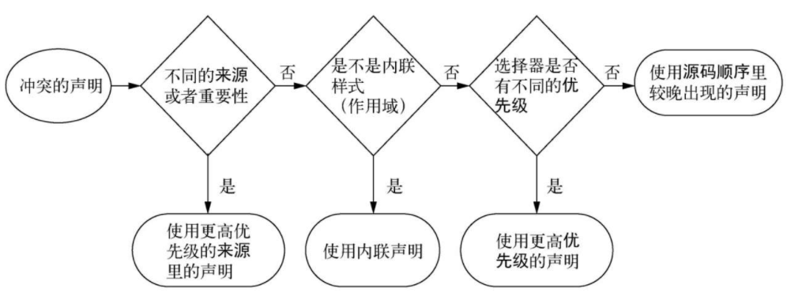
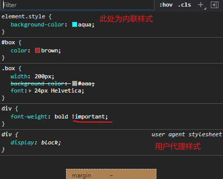

CSS本质上就是声明规则，即在各种条件下，我们希望产生特定的效果。而且需要考虑到不同情形下的变化和影响，所以CSS开发很重要的一点就是**以可预测的方式书写**规则。

## 层叠

### 层叠规则

层叠指的是当元素同时采用不同的样式时，决定哪一种会生效的规则，它决定了如何解决冲突。

如果一个样式声明在层叠中“胜出”，它就被称作一个**层叠值**。元素的每个属性最多只有一个层叠值。

当声明冲突时，层叠会依据三种条件解决冲突。

1. 样式表的来源：样式是从哪里来的，包括你的样式和浏览器默认样式等。

2. 选择器优先级：哪些选择器比另一些选择器更重要。

3. 源码顺序：样式在样式表里的声明顺序。

   




### 样式来源

- 用户样式表：
  - 行内样式
  - 内联样式
  - 外部样式
- 用户代理样式表：是浏览器用来设置默认样式的，其优先级低于用户样式表。
- `! important`声明：添加了此声明的样式会覆盖其他任何样式，若是两个冲突的样式都有此声明，则再根据优先级和源码顺序判断。

#### 行内样式（内联）

直接在标签的`style`属性里声明，这个声明只会作用于当前元素。实际上行内元素属于“带作用域的”声明，它会覆盖任何来自样式表或者`<style>`标签的样式。如：

```html
<div style="color: yellow;"></div>
```

#### 内部样式（内嵌）

在`<style>`标签里的声明，如：

```html
<style>
	div {
    	color: yellow;
	}
</style>

```

#### 外部样式（外链）

通过`<link>`标签引入的样式或者通过`Javascript`动态设置的样式。

### 优先级

优先级的准确规则如下。

- 如果选择器的ID数量更多，则它会胜出（即它更明确）。
- 如果ID数量一致，那么拥有最多类的选择器胜出。
- 如果以上两次比较都一致，那么拥有最多标签名的选择器胜出。
- 伪类选择器（如：hover）和属性选择器（如[type="input"]）与一个类选择器的优先级相同。
- 通用选择器（＊）和组合器（>、+、~）对优先级没有影响。

如：

```html
<div id="box" class="box" style="background-color: aqua ;">box</div>
```

```css
#box{
    color:brown;
}
.box {
    width: 200px;
    background-color: #aaa;
    font: 24px Helvetica;
}
div {
    font-weight: bold !important;
}
```

上面代码在开发者工具中显示为：



### 源码顺序

选择器优先级相同的情况下，源码顺序最终决定了哪个声明生效，即靠后会覆盖之前出现的。

如链接样式的常用顺序写法`lvha`：

```css
a:link {
    color: rgb(255, 0, 0);
}
a:visited {
    color: blue;
}
a:hover{
    color: blueviolet;
    font-size: 20px;
}
a:active{
    color: brown;
}
```

## 继承

如果一个元素的某个属性没有层叠值，则可能会继承某个祖先元素的值。

> 不是所有的属性都能被继承。默认情况下，只有特定的一些属性能被继承，通常是我们希望被继承的那些。它们主要是跟文本相关的属性：color、font、font-family、font-size、font-weight、font-variant、font-style、line-height、letter-spacing、text-align、text-indent、text-transform、white-space以及word-spacing。
>
> 还有一些其他的属性也可以被继承，比如列表属性：list-style、list-style-type、list-style-position以及list-style-image。表格的边框属性border-collapse和border-spacing也能被继承。注意，这些属性控制的是表格的边框行为，而不是常用于指定非表格元素边框的属性。（恐怕没人希望将一个<div>的边框传递到每一个后代元素。）以上为不完全枚举，但是已经很详尽了。
>
> --《深入解析CSS》

开发者工具的样式检查器显示了所检查元素的每个选择器，它们根据优先级排列。在选择器下方是继承属性。元素所有的层叠和继承一目了然。

## inherit | 

### inherit

- 想用继承代替一个层叠值。这时候可以用inherit关键字。可以用它来覆盖另一个值，这样该元素就会继承其父元素的值。

- 还可以使用inherit关键字强制继承一个通常不会被继承的属性，比如边框和内边距。

### initial

- 撤销作用于某个元素的样式。这可以用initial关键字来实现。每一个CSS属性都有初始（默认）值(用户代理样式表)。
- auto不是所有属性的默认值，对很多属性来说甚至不是合法的值。比如border-width: auto和padding: auto是非法的，因此不会生效。
- 声明display: initial等价于display: inline。不管应用于哪种类型的元素，它都不会等于display: block。这是因为initial重置为属性的初始值，而不是元素的初始值。inline才是display属性的初始值。

## 属性简写

1. 简写属性会默默覆盖其他样式

大多数简写属性可以省略一些值，只指定我们关注的值。但是要知道，这样做仍然会设置省略的值，即它们会被隐式地设置为初始值。这会默默覆盖在其他地方定义的样式。如`<div class=titile""></div>`的样式：

```css
div {
	font-weight: bold;
}
.title {
	font: 32px Arial, Helvetica, sans-serif
}
```

实际上等同于：

```css
div {
	font-weight: bold;
}
.title {
    font-style: normal;
    font-variant: normal;
    font-weight: normal;
    font-stretch: normal;
    line-height: normal;
    font-size: 32px;
    font-family: Arial, Helvetica, sans-serif;
}
```

在所有的简写属性里，font的问题最严重，因为它设置的属性值太多了。因此，要避免在`<body>`元素的通用样式以外使用font。当然，其他简写属性也可能会遇到一样的问题，因此要当心。

2. 简写值的顺序

   - 顺时针方向：上-右-下-左

     大多数情况只需要指定两个值。尤其对于较小的元素，左右的内边距最好大于上下内边距。这种样式很适合网页的按钮或者导航链接

   - 水平-垂直：如`box-shadow` 、`background-position`、`text-shadow`等，按照笛卡尔坐标来指定方向，先水平再垂直。

## 总结

- 判断最终选用样式的顺序：
  1. 看冲突的样式是否是同一来源
  2. 根据选择器的优先级判断
  3. 再根据源码顺序判断
- 通常最好让优先级尽可能低，这样当需要覆盖一些样式时，才能有选择空间。
- 少用id选择器和`!important`声明。
- 注意属性简写中的隐式初始化：不要对字体属性简写。