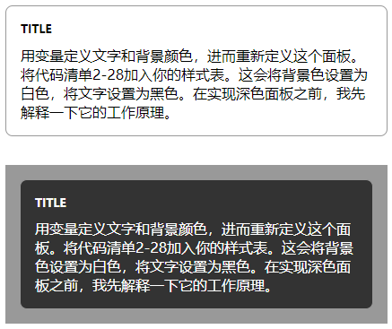

层叠变量的自定义属性（Custom Properties for CascadingVariables）可以声明一个变量，为它赋一个值，然后在样式表的其他地方引用这个值，可以大大能减少样式表中的重复。

## 定义

变量名前面必须有两个连字符（--），用来跟CSS属性区分，剩下的部分可以随意命名。

```css
:root {
    --main-font: Helvetica, Arial, monospace;
}
```

调用函数var()就能使用该变量。

```css
p {
    font-family: var(--main-font, Arial);
}
```

==var()函数接受第二个参数==，它指定了备用值。如果第一个参数指定的变量未定义，那么就会使用第二个值。

## 动态改变自定义属性

==自定义属性的声明能够层叠和继承==：可以在多个选择器中定义相同的变量，这个变量在网页的不同地方有不同的值。

有以下代码：

```html
    <div class="panel">
        <h2>title</h2>
        <div class="body">
            用变量定义文字和背景颜色，进而重新定义这个面板。将代码清单2-28加入你的样式表。这会将背景色设置为白色，将文字设置为黑色。在实现深色面板之前，我先解释一下它的工作原理。
        </div>
    </div>
    <aside class="dark">
        <div class="panel">
            <h2>title</h2>
            <div class="body">
                用变量定义文字和背景颜色，进而重新定义这个面板。将代码清单2-28加入你的样式表。这会将背景色设置为白色，将文字设置为黑色。在实现深色面板之前，我先解释一下它的工作原理。
            </div>
        </div>
    </aside>
```

其样式为：

```css
:root {
    --main-bg: #fff;
    --main-color: #000;
}
.panel {
    font-size: 1rem;
    padding: 1em;
    border: 1px solid #999;
    border-radius: 0.5em;
    background-color: var(--main-bg);
    color: var(--main-color);
}
.panel>h2 {
    margin-top: 0;
    font-size: 0.8em;
    font-weight: bold;
    text-transform: uppercase;
}
.dark{
    margin-top: 2em;
    padding: 1em;
    background-color: #999;
    --main-bg: #333333;
    --main-color: #fff;
}
```

在浏览器中显示效果为：



在本例中，总共定义了自定义属性两次：第一次在根元素上（--main-color为黑色），第二次在深色容器上（--main-color为白色）。自定义属性就像作用域变量一样，因为它的值会被后代元素继承。在深色容器中，--main-color为白色，在页面其他地方，则是黑色。

## JS改变自定义属性

可以使用JavaScript在浏览器中实时访问和修改自定义属性。

```javascript
let rootElement = document.documentElement;
let styles = getComputedStyle(rootElement);
let mainColor = styles.getPropertyValue('--main-bg');
console.log(mainColor.trim());

rootElement.style.setProperty('--main-bg', '#cdf');
```


注意：在不支持自定义属性的浏览器上，任何使用var()的声明都会被忽略。此时需要添加回退方案。

```css
color: black;
color: var(--main-color);
```

