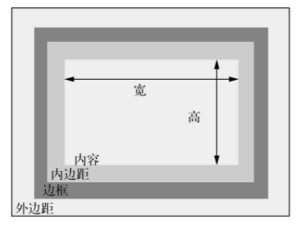
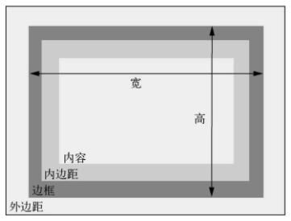

## 文档流

> 普通文档流——指的是网页元素的默认布局行为。行内元素跟随文字的方向从左到右排列，当到达容器边缘时会换行。块级元素会占据完整的一行，前后都有换行。

普通文档流是为限定的宽度和==无限的高度==设计的。内容会填满视口的宽度，然后在必要的时候折行。因此，容器的高度由内容天然地决定，而不是容器自己决定。

## 两种盒模型

在CSS中可以使用box-sizing属性调整盒模型的行为。

- box-sizing的默认值为==content-box==，这意味任何指定的宽或高都只会设置内容盒子的大小。

  

- box-sizing设置为==border-box==后，height和width属性会设置内容、内边距以及边框的大小总和。

  

为了使整个页面方便使用统一的模型，可以全局设置。

```css
*,
::before,
::after {
    box-sizing: border-box;
}
```

但实际环境中可能有第三方组件使用的是`content-box`，为了兼容这个问题，可以修改上述代码如下：

```css
:root {
    box-sizing: border-box;
}
*,
::before,
::after {
    box-sizing: inherit;
}
```

盒模型通常不会被继承，但是使用`inherit`关键字可以强制继承。

如下述代码所示，可以在必要时选中第三方组件的顶级容器，将其恢复为`content-box`。这样组件的内部元素会继承该盒模型。

```css
.third-party-component {
    box-sizing: content-box;
}
```

## 宽度溢出

假设现在有两个浮动的盒子，需要给列之间加上间隔，可使用：

```css
.left {
    float: left;
    width: 70%;
}
.right {
    float: left;
    margin-left: 1.5em;
    width: calc(30% -1.5em);
}
```

这种方式不仅能够使用em指定间距，而且能让代码意图更明白。

## 高度溢出

### 固定高度

由于普通文档流的机制，当明确设置一个元素的高度时，内容可能会溢出容器。当内容在限定区域放不下，渲染到父元素外面时，就会发生这种现象。

用overflow属性可以控制溢出内容的行为。

- visible（默认值）：所有内容可见，即使溢出容器边缘。
-  hidden：溢出容器内边距边缘的内容被裁剪，无法看见。
-  scroll：容器出现滚动条，用户可以通过滚动查看剩余内容。在一些操作系统上，会出现水平和垂直两种滚动条，即使所有内容都可见（不溢出）。不过，在这种情况下，水平滚动条不可滚动（置灰）。（推荐用auto）
-  auto——只有内容溢出时容器才会出现滚动条。

    

### 百分比高度

用百分比指定高度存在问题。==百分比参考的是元素容器块的大小，但是容器的高度通常是由子元素的高度决定的（默认由子元素撑开）==。这样会造成死循环，浏览器处理不了，因此它会忽略这个声明。要想让百分比高度生效，必须给父元素明确定义一个高度。

#### 视口的相对单位`vh`

直接使用`height: 50vh;`，即可实现视口高度的50%。

#### 等高列

现代浏览器支持了CSS表格，可以轻松实现等高列，比如IE8+支持display: table, IE10+支持弹性盒子或者Flexbox，都默认支持等高列。

1. CSS表格布局

   用CSS表格布局替代浮动布局。给容器设置`display: table`，给每一列设置`display:table-cell`。

   ```css
   .container {
       display: table;
       width: 100%; /*表格填满容器宽度*/
   }
   .left {
       display: table-cell;
       width: 70%;
   }
   .right {
       display: table-cell;
       /*margin-left: 1.5em; 外边距失效*/
       width: 30%;
   }
   ```

   默认情况下，显示为table的元素宽度不会扩展到100%，因此需要明确指定宽度。而且外边距并不会作用于`table-cell`元素因此左右两侧的内容间隔失效。

   解决方法是给表格元素添加`border-spacing`属性来定义单元格的间距。该属性会向相邻单元格间以及表格外边缘设置同等的宽度。因此还需清空容器左右两侧的边缘：在容器外部包裹一个元素，设置其左右外边距负为以抵消`border-spacing`的影响。

   ```css
   .wrapper{
       margin: 0 -1.5em;
   }
   .container {
       display: table;
       width: 100%; /*表格填满容器宽度*/
       border-spacing: 1.5em;
   }
   ```

   > 浏览器现在支持将各种元素显示为表格，而不只是<table>，因此我们可以一边享受表格布局带来的好处，一边维护语义标记。然而这种方式并不是完美的解决方案，HTML表格的colspan和rowspan属性在CSS中没有可替代的方案，而且浮动、Flexbox以及inline-block可以实现表格无法实现的布局。

   

2. Flexbox

   Flexbox实现两列等高布局不需要一个额外的div包裹元素，它默认会产生等高的元素。此外也不需要使用负外边距。

   ```css
   .container {
       display: flex;
   }
   .left {
       width: 70%;
   }
   .right {
       width: 30%;
       margin-left: 1.5em;
   }
   ```

   除非别无选择，否则==不要明确设置元素的高度==。先寻找一个替代方案。设置高度一定会导致更复杂的情况。

### 最大值和最小值

`min-height`和`max-height`。你可以用这两个属性指定最小或最大值，而不是明确定义高度，这样元素就可以在这些界限内自动决定高度。

如果你想要将一张大图放在一大段文字后面，但是担心它溢出容器，就可以用min-height指定一个最小高度，而不指定它的明确高度。这意味着元素至少等于你指定的高度，如果内容太多，浏览器就会允许元素自己扩展高度，以免内容溢出。

还有类似的属性是min-width和max-width，用于限制元素的宽度。

## 总结

- 全局设置盒模型为`border-box`。

- 不要明确设置元素的高度