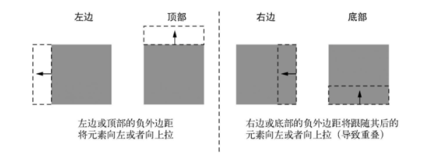

## 容器外边距折叠

如果不给一个块级元素指定宽度，它会自然地填充容器的宽度。但如果在右边加上负外边距，则会把它拉出容器。



如果设置左边或顶部的负外边距，元素就会相应地向左或向上移动，导致元素与它前面的元素重叠，如果设置右边或者底部的负外边距，并不会移动元素，而是将它后面的元素拉过来。给元素底部加上负外边距并不等同于给它下面的元素顶部加上负外边距。

### 文字折叠

外边距折叠的主要原因与包含文字的块之间的间隔相关。段落默认有1em的上外边距和1em的下外边距。这是用户代理的样式表添加的，但当前后叠放两个段落时，它们的外边距不会相加产生一个2em的间距，而会折叠，只产生1em的间隔。

==折叠外边距的大小等于相邻外边距中的最大值==。

### 多个外边距折叠

即使两个元素不是相邻的兄弟节点也会产生外边距折叠。

所有相邻的顶部和底部外边距会折叠到一起。如果在页面中添加一个空的、无样式的div（没有高度、边框和内边距），它自己的顶部和底部外边距就会折叠。

### 防止外边距折叠

-  对容器使用overflow: auto（或者非visible的值），防止内部元素的外边距跟容器外部的外边距折叠。这种方式副作用最小。
- 在两个外边距之间加上边框或者内边距，防止它们折叠。
-  如果容器为浮动元素、内联块、绝对定位或固定定位时，外边距不会在它外面折叠。
-  当使用Flexbox布局时，弹性布局内的元素之间不会发生外边距折叠。网格布局同理。
- 当元素显示为table-cell时不具备外边距属性，因此它们不会折叠。此外还有table-row和大部分其他表格显示类型，但不包括table、table-inline、table-caption。

## 容器内元素间距

通常我们需要给一个容器内的元素设置间距会使用`margin-top`

，但同时希望第一个子元素不应用`margin-top`，有两种方法可以解决这个问题。

### [紧邻兄弟组合器](https://developer.mozilla.org/zh-CN/docs/Web/CSS/Adjacent_sibling_selectors)

`+` 组合器选择相邻元素，即后一个元素紧跟在前一个之后，并且共享同一个父节点。`h2 + p` 会匹配所有紧跟在 `h2`元素后的 `p`元素。

```css
.button-link + .button-link {
        margin-top: 1.5em;
}
```

如上样式可以给一个侧边栏的除第一个元素之外的所有链接添加间距。

但是这样并不完美，如果后续内容有变动，比如新增其他组件，或者内容位置有变化，这种解决方案将变得很繁琐。

### 猫头鹰选择器

猫头鹰选择器：* + *`，开头是一个通用选择器（＊），它可以选中所有元素，后面是一个相邻兄弟组合器（+），最后是另一个通用选择器。==它会选中页面上有着相同父级的非第一个子元素==。

将上面的样式改写成：

```css
* + * {
        margin-top: 1.5em;
}
```

这样不管侧边栏中的内容如何变化，都可以较好地适应。但是这也会对其他有着相同父级的子元素产生效果，如下图：


侧边栏间距效果实现了，但是左边主题和侧边栏同在主题元素下，所以侧边栏上方也产生了1.5em的间距。因此要对侧边栏设置`margin-top: 0;`将其覆盖。

猫头鹰选择器是需要权衡的。它省去了许多的需要设置外边距的地方，但是在某些不想加外边距的地方则需要覆盖。通常只在有并列元素，或者有多列布局时这样使用。有时还需要根据设计，给段落和标题设置特定的外边距。