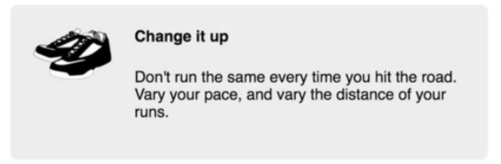
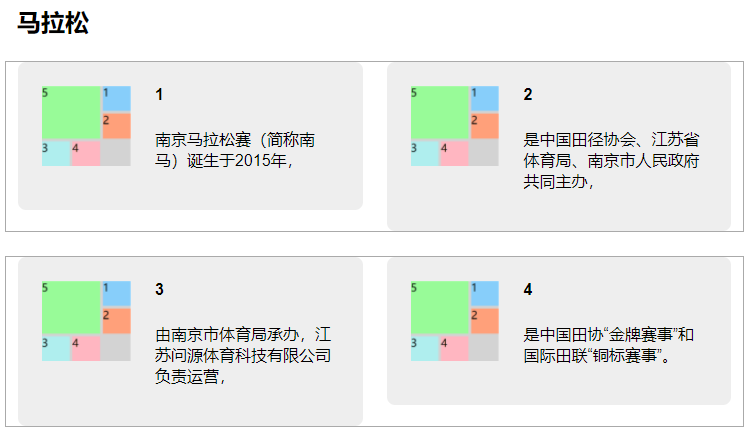

## 垂直居中指南


> 为什么`vertical-align`不生效
>
> vertical-align声明只会影响行内元素或者table-cell元素。对于行内元素，它控制着该元素跟同一行内其他元素之间的对齐关系。比如，可以用它控制一个行内的图片跟相邻的文字对齐。
>
> 对于显示为table-cell的元素，vertical-align控制了内容在单元格内的对齐。如果你的页面用了CSS表格布局，那么可以用vertical-align来实现垂直居中。

方法：

1. 可以用一个自然高度的容器吗？给容器加上相等的上下内边距让内容居中。不管容器里的内容显示为行内、块级或者其他形式，这种方法都有效，但有时我们想给容器设置固定高度，或者无法使用内边距，因为想让容器内另一个子元素靠近容器的顶部或者底部。
2.  容器需要指定高度或者避免使用内边距吗？对容器使用display: table-cell和vertical-align: middle。
3. 可以用Flexbox吗？ 如果不需要支持IE9，可以用Flexbox居中内容。
4.  容器里面的内容只有一行文字吗？设置一个大的行高，让它等于理想的容器高度。这样会让容器高度扩展到能够容纳行高。如果内容不是行内元素，可以设置为inline-block。
5.  容器和内容的高度都知道吗？将内容绝对定位。（只有当前面提到的方法都无效时才推荐这种方式。）
6. 不知道内部元素的高度？用绝对定位结合变形（transform）。（还是只有当前面提到的方法都无效时才推荐该方法。）

## 双容器模式

这种布局常用于将网页内容居中。通过将内容放置到两个嵌套的容器中，然后给内层的容器设置外边距，让它在外层容器中居中。如：

```css
body {
    background-color: #eee;
}
.container {
    max-width: 1080px;
    margin: 0 auto;
}
```

这里==使用了max-width而不是width==，因此如果视口宽度小于1080px的话，内层容器就能缩小到1080px以下。换句话说，在小视口上，内层容器会填满屏幕，在大视口上，它会扩展到1080px。这种方式能有效避免在小屏幕上出现水平滚动条。

## 媒体对象

让图片在一侧，一段文字出现在图片的旁边。



这种布局模式有好几种实现方案，包括：

- Flexbox
- 表格布局
- 浮动（BFC）

## 子元素填满父元素高度

设置父容器的display为flex。

若有双重父容器，如下图：



每行中有两个列，每列的高度由其中的内容决定，若要两侧等高，可以设置：

```css
.row {
    display: flex;
}
.column {
    display: flex;
}
```

