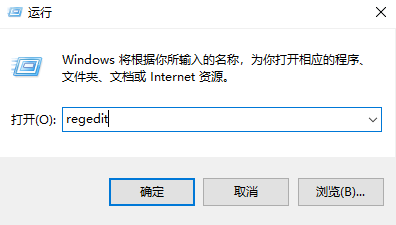
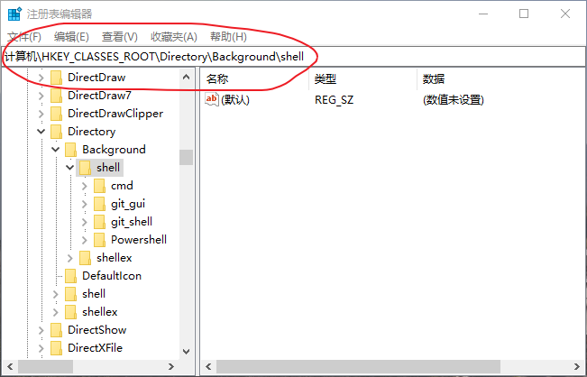
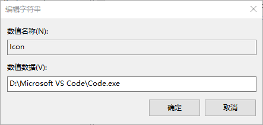
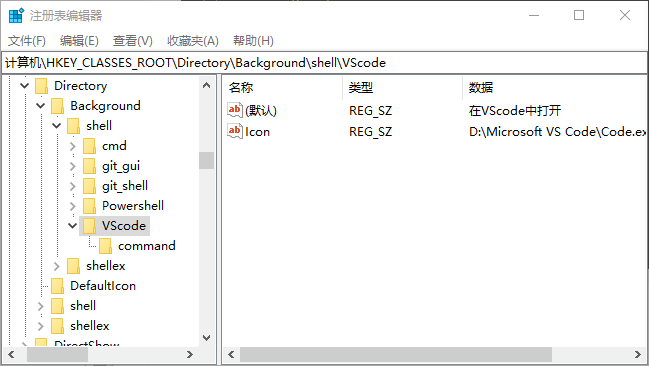

[toc]

## 设置环境变量

1. `win + R`打开运行窗口，输入`sysdm.cpl`,回车。
   
   

2. 打开的界面中选中`高级-环境变量`即可配置系统和用户环境变量。
   
    

3. 这个界面也可以修改计算机名称，修改后会在终端显示新名称。

## 将程序添加到右键菜单

1. `win + R` 打开运行窗口，输入`regedit`回车打开注册表编辑器。

    

2. 定位至`HKEY_CLASSES_ROOT\Directory\background\shell`，较新的win版本可以直接复制路径到地址栏回车进入。
   

3. 以添加VScode为例，首先选中左侧`shell`栏，右击选择`新建-项`，将新建项命名为VScode，然后右击VScode项，选择`新建-字符串值`，然后名称填"Icon"，数据填vscode的安装路径。这样就能在右键菜单中显示图标了。
   
   

    然后双击上方的默认值，其数据为右键菜单面板的描述，例如修改为：在VScode中打开。

    

4. 然后右击VScode栏，新建名为`command`的项，将VScode的路径填入其默认值的数值。这样就可以在文件夹中右击空白处用VScode打开该文件夹。

5. 上述完成的只是在文件夹内部右击菜单显示VScode，要想直接右击文件夹打开，需要同步骤2一样，进入`HKEY_CLASSES_ROOT\Directory\shell`，之后按步骤3、4添加路径即可。

6. 同理如果在`HKEY_CLASSES_ROOT\*\shell\VScode`中添加VScode则右键任何类型文件都可以选择使用VScode打开，其中`*`匹配的是任意文件路径。这一步一般情况下无需设置，有兴趣自行添加。

7. 除了在注册表图形化界面添加，还可以通过运行注册文件添加，具体参考：

    - [如何在Windows上添加VSCode到右键菜单](https://github.com/zhirui1994/zhirui1994.github.io/issues/26)