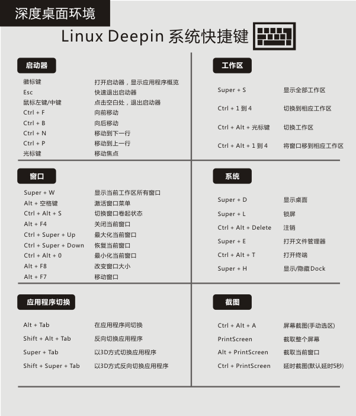

[toc]

## 1.自定义标题栏高度

1. 先创建一个目录，如果有就不用了：

   ```SHELL
   # 如果你是用的默认的白色主题
   mkdir -p ~/.local/share/deepin/themes/deepin/light
   # 如果你用的黑色主题
   mkdir -p ~/.local/share/deepin/themes/deepin/dark
   ```

2. 进入改目录后创建配置文件：

   ```SHELL
   cd ~/.local/share/deepin/themes/deepin/dark
   deepin-editor titlebar.ini
   ```

3. 加入下面内容并保存：

   ```css
   [Active]
   	height=24
   [Inactive]
   	height=24
   ```

   注销或者重启系统即可生效。

## 2.系统快捷键

